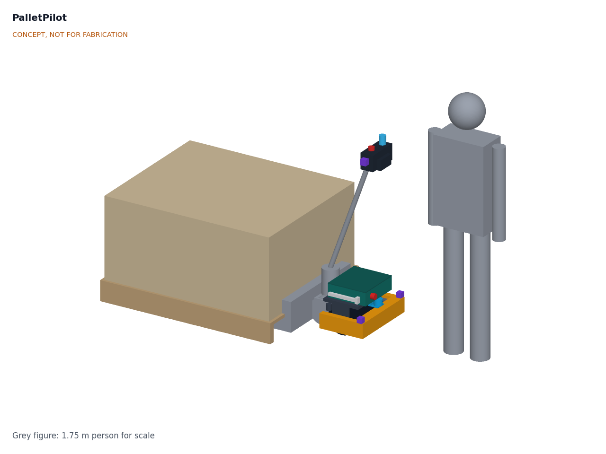
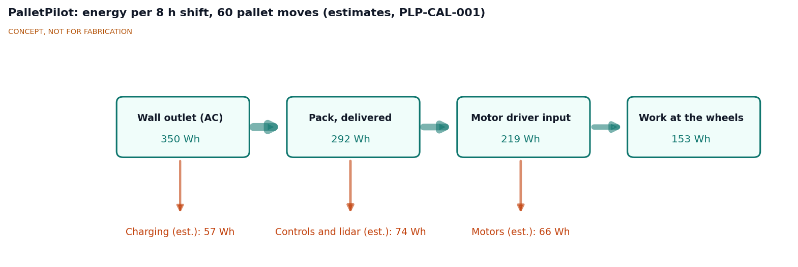
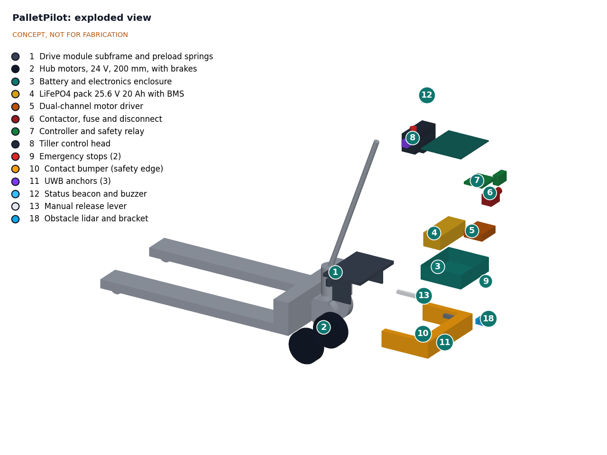
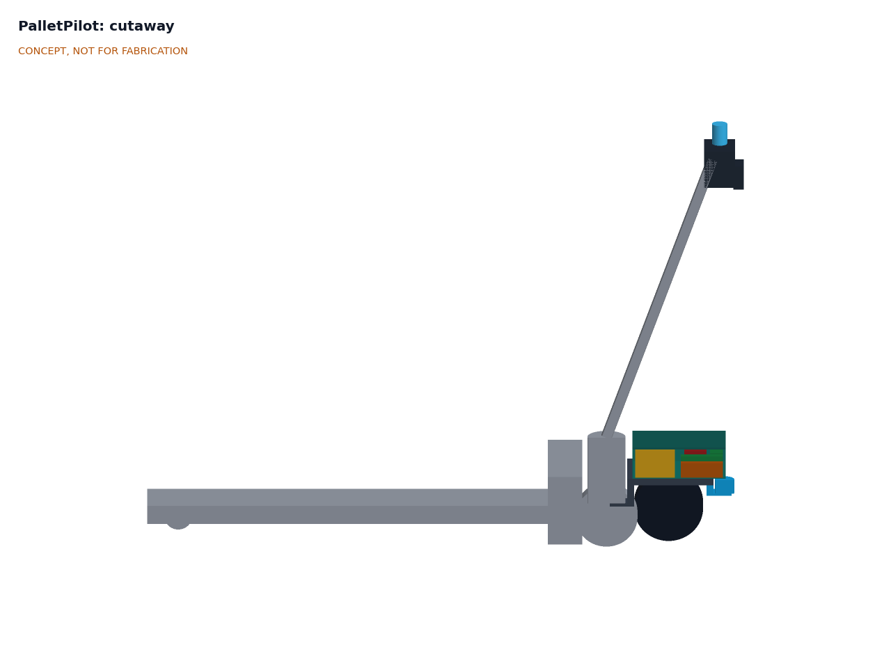

# PalletPilot design precis

PalletPilot clamps a drive module with two 24 V hub motors to the steering yoke of an ordinary manual pallet jack, powers it from a 25.6 V LiFePO4 pack in a low enclosure on the same yoke, and adds a walkie-style tiller head, a UWB follow-me mode and layered stopping: hardwired emergency stops, a 2D lidar stop layer in follow mode and a contact bumper as the last layer. The calculation note PLP-CAL-001 shows the kit can move a 1,000 kg pallet at walking pace for a full shift of 60 moves on one overnight charge, start on a 2 % ramp, and stop from follow-mode speed inside the lidar's field without reaching the operator it follows. Three targets are missed on paper: follow bearing accuracy (about ±16° against ±10°), kit mass (41.7 kg against 40 kg) and cost ($1,580 against the approved $1,550). The lidar is not safety-rated, so the kit is a research prototype for a closed area.

*Figure 1. PalletPilot fitted to a 27 x 48 in manual jack under a 1,000 kg pallet, with a 1.75 m person for scale. Kit parts are colored; the donor jack is grey.*

## How it works

1. **Drive.** A steel subframe clamps to the jack's steering yoke. Two 200 mm hub motors sit on trailing cheeks 180 mm from the steering axis, toward the handle end, on a 260 mm track that passes beside the steer wheels. Springs press them onto the floor with 1.5 kN of preload. They turn with the yoke, so the kit steers with the handle like the bare jack.
2. **Walk mode.** The operator holds the tiller as usual and sets speed with a thumbwheel. As on a factory walkie, drive is enabled only with the handle between about 20° and 70° from vertical, a belly-reverse paddle pushes the truck away if it pins the operator, and releasing the handle to upright brakes the truck. The two motors run at equal torque so the handle steers freely.
3. **Follow mode.** With the key switch set to follow and the handle latched upright by a gas spring, the operator walks ahead of the drive end wearing a UWB tag. Two anchors on the bumper corners and one on the tiller head measure range to the tag. The controller turns the two motors at different speeds while the truck rolls, and this steers the yoke toward the tag. It holds a 1.5 m gap, stops when the operator stops, and stops if the tag is lost, the tag's stop button is pressed or the gap exceeds 3 m.
4. **Layered stopping.** In follow mode a 2D lidar just inside the bumper face watches a 0.86 m protective field ahead of the truck, 885 mm wide, and commands a controlled stop when anything enters it; a longer warning field slows the truck first. The contact bumper, the two emergency stops and the tag stop open a safety relay that drops the main contactor, and the spring-applied hub motor brakes close when power is removed.
5. **Charge.** A certified 29.2 V, 5 A charger fills the pack from a wall outlet in about 4.5 h overnight.
6. **Push by hand.** A release lever raises the spring seats and lifts the drive wheels clear so the jack can be pushed as a manual jack if the pack is flat or the kit fails.

*Figure 2. Energy per 8 h shift of 60 pallet moves, in Wh, from PLP-CAL-001. All values are estimates.*

## Main components

Numbers match the exploded view (Figure 3), `bom/bom.csv` and drawing PLP-DWG-001.

Table 1. Main components.

| # | Component | Choice | Notes |
| --- | --- | --- | --- |
| 1 | Drive module subframe | 6 mm steel plate clamp to the yoke with a tongue under the yoke plate, trailing cheeks, two springs giving 1.5 kN preload | Clamp pattern per donor model; about 9.8 kg |
| 2 | Hub motors | Two 24 V brushless hub servo motors, 200 mm, 12 N·m continuous and 30 N·m peak or more, spring-applied brakes of 20 N·m or more | About 7 kg each; brake data to confirm |
| 3 | Enclosure | 2 mm aluminium box 270 x 300 x 95 mm, IP54, top at 320 mm, below the 350 mm handle pivot | Turns with the yoke; never on the forks |
| 4 | Battery | 8S6P LiFePO4, 25.6 V, 20 Ah (512 Wh), BMS with charge temperature cut-off | About 4.9 kg |
| 5 | Motor driver | Dual-channel 24 V servo driver, 2 x 15 A continuous, 30 A peak, CAN | Differential control for follow mode |
| 6 | Contactor, fuse and disconnect | 80 A fuse, main contactor with pre-charge, lockable disconnect | Opened by the safety relay |
| 7 | Controller and safety relay | ESP32-S3 class controller; dual-channel safety relay | Software never closes the stop chain alone |
| 8 | Tiller control head | Thumbwheel throttle, belly-reverse paddle, mode key, horn, beacon mount | Replaces the jack's grip |
| 9 | Emergency stops | Two red mushroom buttons, tiller head and enclosure rear face | Hardwired |
| 10 | Contact bumper | Pressure-sensitive safety edge, 40 mm travel, on a U hoop around the drive end | Last stopping layer |
| 11 | UWB anchors | Three DWM3000 class modules: two on the bumper corners (450 mm baseline), one on the tiller head | Range about 10 cm precision ([Qorvo](https://www.qorvo.com/products/p/DWM3000)) |
| 12 | Status beacon and buzzer | On the tiller head; amber in walk mode, blue in follow mode | Moved off the lid for handle clearance |
| 13 | Manual release lever | 400 mm over-center lever lifts the drive wheels | About 117 N effort |
| 18 | Obstacle lidar | 2D time-of-flight lidar (RPLIDAR C1 class, 10 Hz, 12 m on white and 6 m on black targets), scan plane 200 mm above the floor | Approved stopping layer; not safety-rated ([DFRobot](https://www.dfrobot.com/product-2803.html)) |
| 14 to 17 | Charger, operator tag, handle sensor and gas spring, wiring | See `bom/bom.csv` | Not modelled |

*Figure 3. Exploded view with numbered callouts matching the BOM. The donor jack is grey and stays in place.*

*Figure 4. Section through the center of the kit, showing the pack (yellow), motor driver (orange), contactor (red) and controller (green) in the low enclosure, and the lidar (blue) under its rear edge.*

## Key numbers

All values come from PLP-CAL-001, which lists its assumptions and the full requirement table. The design load case is 1,106 kg in total (1,000 kg pallet, 64 kg jack, 41.7 kg kit) on level, dry, sealed concrete.

Table 2. Drive, stopping, tracking, energy, mass and cost.

| Quantity | Value | Requirement |
| --- | --- | --- |
| Rolling and breakaway force, level | 130 N and 271 N | |
| Available traction (1.5 kN preload, friction 0.5) | 750 N (600 N at friction 0.4) | |
| 2 % ramp start | 488 N needed, margin 1.54 | R3 met |
| Torque per motor, worst case in R2 and R3 | 25.5 N·m of 30 N·m specified | R2 met; 1,500 kg on level floors only |
| Peak wheel power and pack current | 554 W; 31 A | Driver and BMS adequate |
| Lidar stop from 0.6 m/s | 0.42 m level; 0.76 m at 1,500 kg on a 2 % downgrade | R7 at risk (0.86 m field) |
| Emergency stop from 1.2 m/s | 1.62 m level; 2.66 m on a 2 % downgrade | |
| Bumper-only speed within 40 mm travel | 0.15 m/s | R8 at risk (target 0.2 m/s) |
| Parking brake on 2 % | 40 N·m available, 21.7 N·m needed | R10 met |
| UWB bearing error | ±16° (2σ) after filtering | R5 not met |
| Energy from the pack per shift | 292 Wh of 410 Wh usable (29 % left) | R12 met |
| Charge time at 5 A | 4.5 h | R13 met |
| Handle clearance over the enclosure | 40 mm at 70°, 14 mm lowered flat | R11 met |
| Added length at floor level | 290 mm | R15 length met |
| Kit mass | 41.7 kg | R15 mass not met |
| Kit parts cost | $1,580 | R17 ($1,550) not met by $30 |
| Donor jack (not in kit) | about $396 new | |

Three findings shaped the TRL 3 layout. First, the TRL 2 enclosure sat above the handle pivot, so the handle would have struck it at about 51°, inside the walk band; the enclosure is now lower and the beacon and second emergency stop have moved. Second, 1.1 kN of preload left the 2 % ramp at risk, so it is now 1.5 kN; with the jack empty the steer wheels then lift slightly and the drive wheels carry the yoke, which is acceptable. Third, because the drive axle is offset from the steering axis, the motors cannot swing the yoke at standstill (98 N·m available against 135 N·m of scrub), so follow mode steers only while rolling, and hand steering at standstill is about 112 N heavier at the grip.

For comparison, a complete 1,500 kg lithium walkie costs about $1,640 ([Home Depot](https://www.homedepot.com/p/3300-lbs-24V-20AH-Lithium-Battery-Electric-Pallet-Jack-Walkie-Truck-w-48-in-x-27-in-Fork-Size-3-1-in-Fork-Lowered-A-1034/326396102)) and the PowerPallet 2000 retrofit about $2,084 ([HoF Equipment](https://hofequipment.com/PowerHandling-Power-Pallet-2000-p1957.html)). The kit's case rests on follow mode and on reusing jacks a site already owns.

## Key design choices

Amish decided the TRL 2 review items on 2026-09-25 (PLP-DDR-001), going with each recommendation.

- **Layered stopping (D1).** A low-cost 2D lidar is the main stopping layer in follow mode, the bumper is the last layer, follow mode runs at 0.6 m/s or less, and trials are for research in a closed area. A safety-rated laser scanner is the named route to workplace use. The pitch now reads "layered stopping".
- **Budget (D2).** $1,550 for the kit, donor jack excluded.
- **Drive layout (D3).** Two hub motors on a sprung module on the yoke, differential drive in follow mode.
- **Power (D4).** 24 V LiFePO4, 20 Ah, not a SwapCell pack; the SwapCell interface changes approved for the portfolio do not apply.
- **Mounting (D5).** Everything on the yoke, now checked for handle clearance (R11 met) and steering bearing load (no added vertical load; up to 750 N horizontal).
- **Speeds (D6).** Walk 1.2 m/s handle-end first, 0.8 m/s forks first, creep 0.3 m/s, follow 0.6 m/s, and follow at 0.2 m/s or less until the lidar layer is built and tested.
- **Kit rating (D7).** 1,000 kg design load; 1,500 kg at 0.8 m/s or less. PLP-CAL-001 limits the 1,500 kg rating to level floors.
- **Legal route (D8).** Research use now; a jack maker's written approval before any workplace trial.
- **TRL 3 sizing choices** made in this revision, within the decided configuration: preload 1.5 kN, motor torque and brake minimums, enclosure height, drive axle position and track, and the lidar's position. Items still open (bumper travel, mass and cost overruns, a second contactor, follow-mode classification, donor models) are listed in PLP-DDR-001 and `docs/REVIEW.md`.

## Safety

> **Safety:** PalletPilot is moving machinery that carries up to 1.5 t close to people's feet and legs, and it contains a lithium battery. Every build is a research prototype for a closed test area, not a certified industrial truck. Do not use it in a workplace until the questions below are answered.

- **Crushing and collision.** A loaded jack at 1.2 m/s carries about 796 J and needs 1.2 to 1.6 m to stop on the level, and 2.7 m on a 2 % downgrade. Foot injuries under the drive end and pinning against racking or walls are the classic walkie hazards. Use the belly-reverse paddle, handle-angle braking, walking-pace speed limits, safety footwear and a bumper hoop that shields the wheels. Never ride on the jack.
- **Follow mode.** The truck moves with no hand on the tiller. The lidar layer is not safety-rated and its detection of dark or shiny clothing at shin height is unproven. Until it is built and tested, follow mode runs only at 0.2 m/s or less in a cordoned area with no other people present, and the bumper-only speed should be 0.15 m/s unless a longer-travel edge is fitted. Loss of the tag, a tag stop press, a gap over 3 m, a lidar fault or any other fault must stop the truck with brakes applied.
- **Emergency stop.** The emergency stops and bumper act through a hardwired safety relay and contactor, never only through software. The spring-applied brakes close on loss of power. A second output channel is proposed for PL d.
- **Runaway on slopes.** Emergency braking falls by about 40 % on a 2 % downgrade. Do not use on ramps steeper than 2 %, and do not move 1,500 kg loads on any ramp.
- **Lithium pack.** LiFePO4 is more stable than other lithium-ion chemistries but still stores 512 Wh and can deliver very high currents. Use a BMS with cell-level protection and a charge temperature cut-off, fuse the pack at the terminal, provide a lockable disconnect, charge on a non-combustible surface away from stored goods, and do not charge below 0 °C or a pack that is damaged or swollen.
- **Legal and training.** In the United States a motorized pallet jack is a powered industrial truck, so operators need formal training and evaluation under 29 CFR 1910.178(l), and modifications affecting capacity or safe operation need the jack maker's prior written approval under 1910.178(a)(4) ([OSHA 1910.178](https://www.osha.gov/laws-regs/regulations/standardnumber/1910/1910.178)). Other countries have similar rules. The kit must not be fitted to a jack used at work without that approval.
- **Donor jack condition.** Do not convert a jack with a cracked frame, a leaking pump or a worn steering bearing. The drive adds up to 750 N of horizontal force at the yoke.

## Open questions

- Classification of follow mode under ISO 3691-4 and the safety functions it then needs.
- Donor survey of three common jacks: yoke geometry, handle pivot height (the enclosure clears a 350 mm pivot by 14 mm), steering bearing condition.
- Floor friction and rolling resistance on real floors, which set the traction margins.
- Hub motor with a published 24 V winding, peak torque and brake torque at about 7 kg or less.
- Closing the R5 bearing gap: angle-of-arrival UWB or lidar leg tracking.
- Bumper-only speed or longer edge travel (R8), and a second stop-chain output (R9).
- Closing the $30 cost and 1.7 kg mass overruns.

Concept media: [blueprint sheet](../media/concept-blueprint.pdf), [interactive 3D model](../media/viewer.html). General arrangement: [PLP-DWG-001](../cad/drawings/PLP-DWG-001.pdf).
